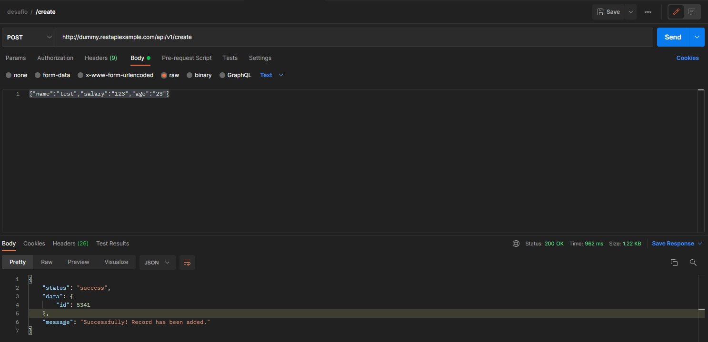
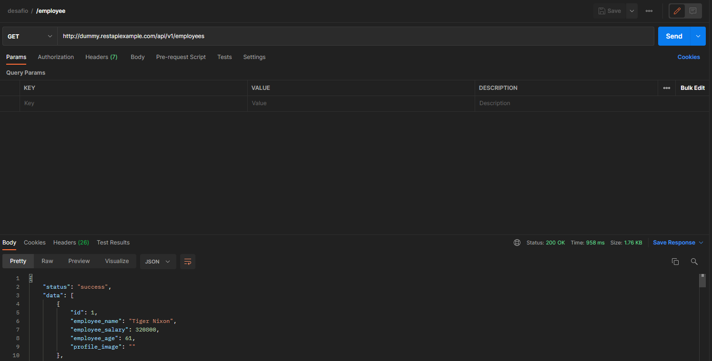

# API Users - Automação API com Ruby e HTTParty

[![NPM Version][npm-image]][npm-url]
[![Build Status][travis-image]][travis-url]
[![Downloads Stats][npm-downloads]][npm-url]


Automation of API scenarios involving create and search user. 





## Development setup

For the development of automation, HTTParty and the Ruby language were used.

Dependencies

```sh
make install requires gems 

```

## Run test

run simple test
```sh
cucumber

```
run test with report generate
```sh
cucumber -f json -o log/report.json -f pretty

```

<!-- Markdown link & img dfn's -->
[npm-image]: https://img.shields.io/npm/v/datadog-metrics.svg?style=flat-square
[npm-url]: https://npmjs.org/package/datadog-metrics
[npm-downloads]: https://img.shields.io/npm/dm/datadog-metrics.svg?style=flat-square
[travis-image]: https://img.shields.io/travis/dbader/node-datadog-metrics/master.svg?style=flat-square
[travis-url]: https://travis-ci.org/dbader/node-datadog-metrics
[wiki]: https://github.com/yourname/yourproject/wiki